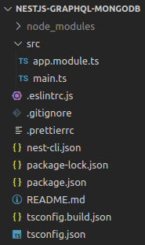

# Create NestJS Project
### Project setup
```bash
# Install NestJS
npm i -g @nestjs/cli

# Create a new NetsJS application 'nestjs-graphql-mongodb'
# option: npm
nest new nestjs-graphql-mongodb
cd nestjs-graphql-mongodb

# Install dependencies
npm i @nestjs/graphql graphql-tools graphql apollo-server-express @nestjs/mongoose mongoose --save
```
Keep only root files `main.ts` and `app.module.ts`



# Start a mongo server instance
### Install Docker engine
https://docs.docker.com/engine/install/ubuntu/
### Docker componse
The Compose file defines services, networks, and volumes for a Docker application. A `service` is an abstract concept implemented on platforms by running the same `container image`. Services store and share persistent data into `volumes`.

The top-level `version` property is defined by specification for backward compability but is only informative.

The top-level `name` property is defined by specification as project name to be used if user doesn't set one explicitly.

### MongoDB 
MongoDB is a NoSQL database that uses JSON-like documents. The MongoDB server in the image listens on the standard port, 27017.

When the container is started for the first time, it will execute files with the extension `.sh` and `.js` that are found in `/docker 

`docker-compose.yml`
```yml
version: '3.9'

services: 
  mongo: 
    image: mongo:latest 
    container_name: my-mongo 
    restart: always 
    environment: 
      MONGO_INITDB_ROOT_USERNAME: rootuser 
      MONGO_INITDB_ROOT_PASSWORD: rootpassword 
    ports: 
      - 27017:27017 
    volumes: 
      - ./docker-entrypoint-initdb.d/mongo-init.js:/docker-entrypoint-initdb.d/mongo-init.js:ro
```
Create a `docker` folder in the root of the NestJS project.
```bash
# Docker Compose
docker-compose up -d
# List containers
docker ps -a
# Stop and Remove containers
docker stop <container-name> && docker rm <container-name>
# List images
docker images
# Remove images
docker rmi <image-id>
```


## Reference
### NestJS
- NestJS First Steps: https://docs.nestjs.com/first-steps
- NestJS Recipes: https://docs.nestjs.com/recipes/crud-generator
- NestJS Mongo: https://docs.nestjs.com/techniques/mongodb
- NestJS GraphQL: https://docs.nestjs.com/graphql/quick-start
- Tutorial: https://javascript.plainenglish.io/build-a-scalable-graphql-server-with-nestjs-mongodb-typescript-1eeda049f7c8
### Docker 
- DockerHub Mongo: https://hub.docker.com/_/mongo
- MongoDB server with Docker Compose: https://dev.to/sonyarianto/how-to-spin-mongodb-server-with-docker-and-docker-compose-2lef
- MongoDB and Docker: https://www.digitalocean.com/community/tutorials/how-to-set-up-flask-with-mongodb-and-docker

<p align="center">
  <a href="http://nestjs.com/" target="blank"></a>
</p>

[circleci-image]: https://img.shields.io/circleci/build/github/nestjs/nest/master?token=abc123def456
[circleci-url]: https://circleci.com/gh/nestjs/nest

  <p align="center">A progressive <a href="http://nodejs.org" target="_blank">Node.js</a> framework for building efficient and scalable server-side applications.</p>
    <p align="center">
<a href="https://www.npmjs.com/~nestjscore" target="_blank"></a>
<a href="https://www.npmjs.com/~nestjscore" target="_blank"></a>
<a href="https://www.npmjs.com/~nestjscore" target="_blank"></a>
<a href="https://circleci.com/gh/nestjs/nest" target="_blank"></a>
<a href="https://coveralls.io/github/nestjs/nest?branch=master" target="_blank"></a>
<a href="https://discord.gg/G7Qnnhy" target="_blank"></a>
<a href="https://opencollective.com/nest#backer" target="_blank"></a>
<a href="https://opencollective.com/nest#sponsor" target="_blank"></a>
  <a href="https://paypal.me/kamilmysliwiec" target="_blank"></a>
    <a href="https://opencollective.com/nest#sponsor"  target="_blank"></a>
  <a href="https://twitter.com/nestframework" target="_blank"></a>
</p>
  <!--[](https://opencollective.com/nest#backer)
  [](https://opencollective.com/nest#sponsor)-->

## Description

[Nest](https://github.com/nestjs/nest) framework TypeScript starter repository.

## Installation

```bash
$ npm install
```

## Running the app

```bash
# development
$ npm run start

# watch mode
$ npm run start:dev

# production mode
$ npm run start:prod
```

## Test

```bash
# unit tests
$ npm run test

# e2e tests
$ npm run test:e2e

# test coverage
$ npm run test:cov
```

## Support

Nest is an MIT-licensed open source project. It can grow thanks to the sponsors and support by the amazing backers. If you'd like to join them, please [read more here](https://docs.nestjs.com/support).

## Stay in touch

- Author - [Kamil Myśliwiec](https://kamilmysliwiec.com)
- Website - [https://nestjs.com](https://nestjs.com/)
- Twitter - [@nestframework](https://twitter.com/nestframework)

## License

Nest is [MIT licensed](LICENSE).
